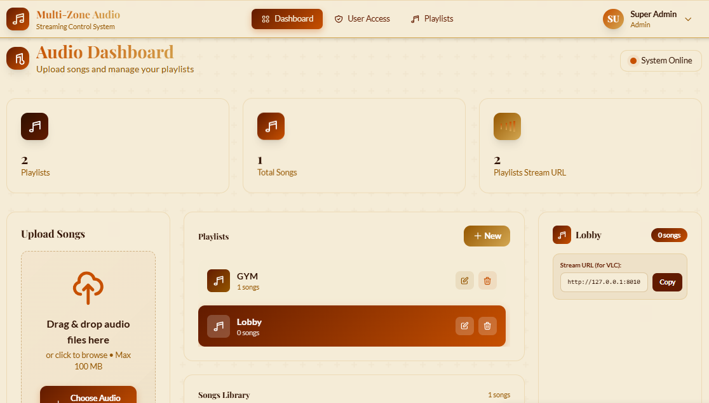

# 🔊 Public Audio System — Music & Audio Streaming Control System

> A web-based public audio control system that lets operators manage music playlists and stream audio to multiple zones/devices over HTTP streaming. Public Audio System integrates Laravel (backend + dashboard), Liquidsoap (audio mixer/engine), and Icecast (streaming server), all orchestrated via Docker.


**Database name:** `mosec` · **Project folder:** `musik-control`

---

## 📸 Dashboard Teaser



---

## ✨ About the Project

Public Audio System is a centralized public address / background music system built for buildings, malls, or other public facilities that need networked audio control across multiple zones. Instead of managing music manually per device, operators upload songs, build playlists, assign them to zones, and the system automatically handles encoding and streaming.

## 👥 Target Users

- **Building/mall administrators** who need a centralized public address system over LAN/internet.
- **Internal broadcast operators** who manage background music per zone/channel.

## 🧱 Tech Stack

| Layer | Technology |
|---|---|
| **Backend / Control Panel** | Laravel 10 (PHP 8.1) |
| **Frontend** | Blade (Laravel templating) + Vite |
| **Database** | MySQL (database: `mosec`) |
| **Audio Engine** | Liquidsoap (mixer & playlist manager) |
| **Streaming Server** | Icecast2 (HTTP audio streaming server) |
| **Containerization** | Docker & Docker Compose |
| **Audio Conversion** | FFmpeg (MP4 → MP3 converter, bundled as `ffmpeg.exe`) |
| **API Auth** | Laravel Sanctum (token-based) |
| **Libraries** | GuzzleHTTP, getID3 (audio metadata reader) |

## 🚀 Project Status

**MVP / Production-ready (v1.0)** — per `STREAMING_GUIDE.md`, marked "✅ Production Ready" (dated February 2026). Several features remain planned (Liquidsoap auto-restart, telnet interface, embedded web player, multi-bitrate HLS).

- No public demo (on-premise/local project).
- Stream accessible at `http://127.0.0.1:8010/{playlist-slug}` while Docker is running.

## 📚 Full Documentation

| Document | Description |
|---|---|
| [Overview](docs/overview.md) | General overview, background, and project goals |
| [Business Problem](docs/business-problem.md) | The operational problem solved by the system |
| [System Architecture](docs/system-architecture.md) | System architecture and audio data flow |
| [Dashboard Features](docs/dashboard-features.md) | Detailed breakdown of control panel features |
| [Deployment](docs/deployment.md) | Installation and deployment guide |
| [Database Design](docs/database-design.md) | Database schema design |
| [API Design](docs/api-design.md) | REST API endpoint documentation |
| [Implementation](docs/implementation.md) | Development process and technical challenges |
| [Lessons Learned](docs/lessons-learned.md) | Key takeaways and future roadmap |

## 📂 Repo Structure

```
mosec-docs/
│
├── README.md
├── docs/
│   ├── overview.md
│   ├── business-problem.md
│   ├── system-architecture.md
│   ├── dashboard-features.md
│   ├── deployment.md
│   ├── database-design.md
│   ├── api-design.md
│   ├── implementation.md
│   └── lessons-learned.md
│
└── assets/
    ├── screenshots/
    ├── diagrams/
    └── ui/
```

## 👤 Author

Built solo as part of a 6th-semester internship program.

---

*This documentation comprehensively covers the development of Public Audio System — Music & Audio Streaming Control System.*
